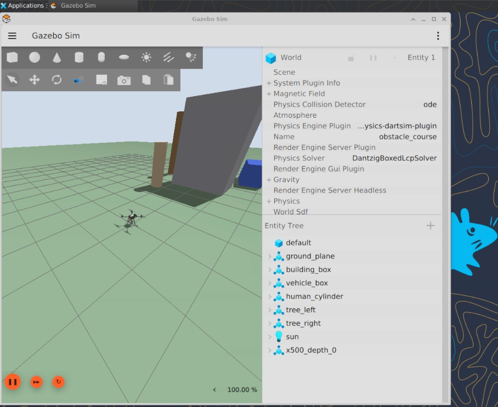
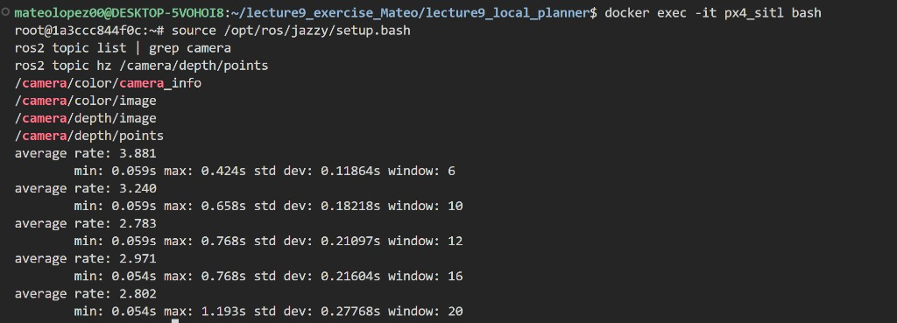
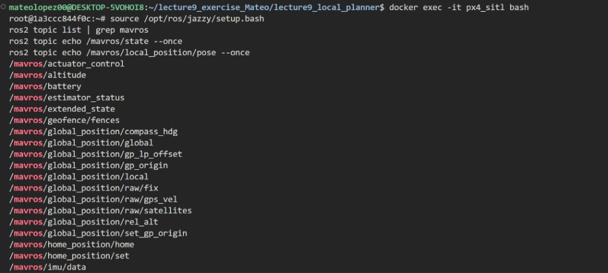
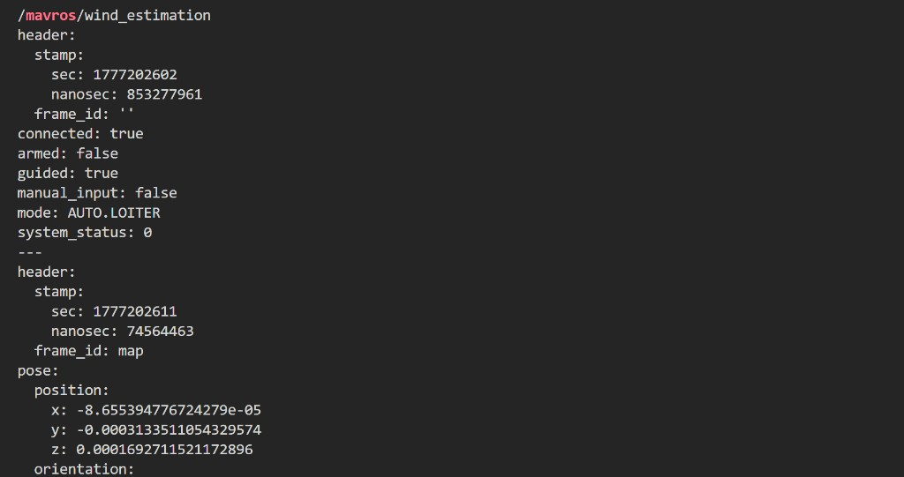
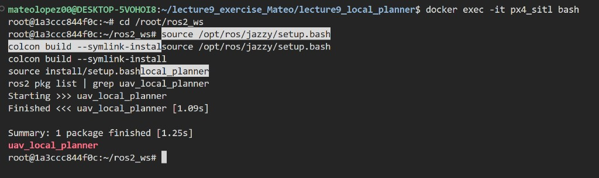
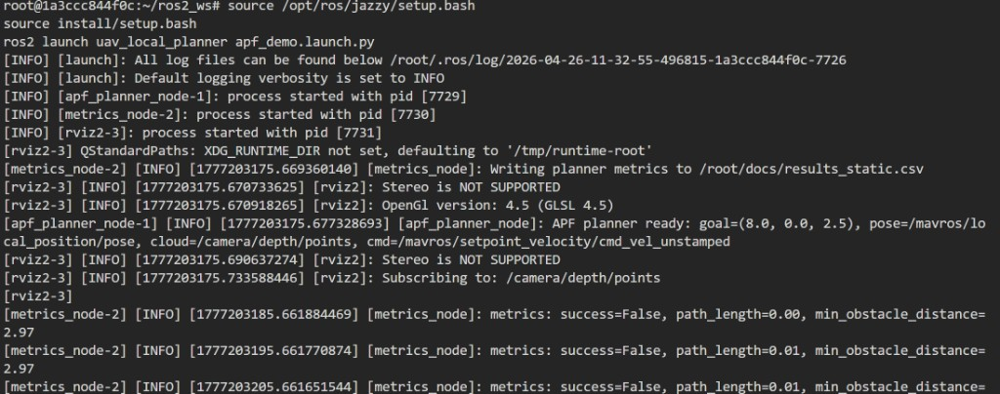
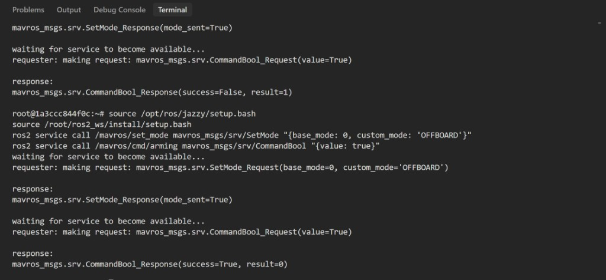
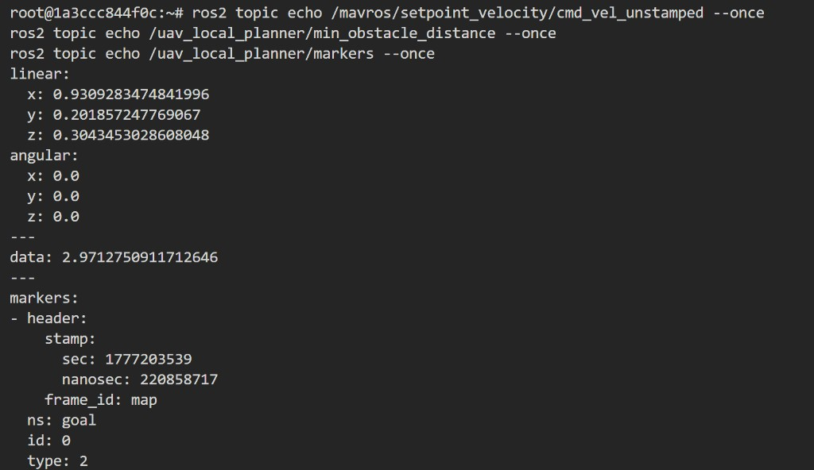

# UAV Local Obstacle Avoidance With ROS 2, PX4 SITL, and Gazebo

Author: Mateo Lopez

## Selected Exercise

I implemented Aufgabe 2, Local Planner: Obstacle Avoidance.

The goal of my work was to run a UAV in PX4 SITL and Gazebo, read obstacle information from a depth camera, and publish local velocity commands from a ROS 2 planner.

I used the provided PX4 simulation base from:

```text
https://github.com/erdemuysalx/px4-sim
```

## What I Built

I built a ROS 2 package called `uav_local_planner`.

The main files are:

```text
ros2_ws/src/uav_local_planner/uav_local_planner/apf_planner_node.py
ros2_ws/src/uav_local_planner/uav_local_planner/metrics_node.py
ros2_ws/src/uav_local_planner/config/apf_params.yaml
ros2_ws/src/uav_local_planner/launch/apf_demo.launch.py
ros2_ws/src/uav_local_planner/rviz/apf_demo.rviz
worlds/obstacle_course.sdf
scripts/spawn_default_obstacles.sh
```

The planner uses an Artificial Potential Field idea. The goal attracts the drone, and obstacle points from the depth camera create a repulsive force. The final force is converted into a velocity command for MAVROS.

## How I Ran The Demo

I started the container:

```bash
docker compose up -d
```

I started PX4 and Gazebo:

```bash
docker exec -it px4_sitl bash
cd /root/PX4-Autopilot
make px4_sitl gz_x500_depth
```

I spawned obstacles into the Gazebo world:

```bash
/root/scripts/spawn_default_obstacles.sh
gz model --list
```

The spawned objects were:

```text
building_box
vehicle_box
human_cylinder
tree_left
tree_right
```



## Depth Camera Bridge

I bridged the Gazebo depth camera topics into ROS 2:

```bash
ros2 run ros_gz_bridge parameter_bridge \
/world/default/model/x500_depth_0/link/camera_link/sensor/IMX214/camera_info@sensor_msgs/msg/CameraInfo@gz.msgs.CameraInfo \
/world/default/model/x500_depth_0/link/camera_link/sensor/IMX214/image@sensor_msgs/msg/Image@gz.msgs.Image \
/depth_camera@sensor_msgs/msg/Image@gz.msgs.Image \
/depth_camera/points@sensor_msgs/msg/PointCloud2@gz.msgs.PointCloudPacked \
--ros-args \
-r /world/default/model/x500_depth_0/link/camera_link/sensor/IMX214/camera_info:=/camera/color/camera_info \
-r /world/default/model/x500_depth_0/link/camera_link/sensor/IMX214/image:=/camera/color/image \
-r /depth_camera:=/camera/depth/image \
-r /depth_camera/points:=/camera/depth/points
```

I verified that the depth camera point cloud was published:

```bash
ros2 topic list | grep camera
ros2 topic hz /camera/depth/points
```



## MAVROS Connection

I started MAVROS with:

```bash
source /opt/ros/jazzy/setup.bash
ros2 launch mavros px4.launch fcu_url:=udp://:14540@localhost:14557
```

I checked the MAVROS topics:

```bash
ros2 topic list | grep mavros
```



I also checked the MAVROS state and local pose:

```bash
ros2 topic echo /mavros/state --once
ros2 topic echo /mavros/local_position/pose --once
```



## Building The Planner

I built the planner package inside the container:

```bash
cd /root/ros2_ws
source /opt/ros/jazzy/setup.bash
colcon build --symlink-install
source install/setup.bash
ros2 pkg list | grep uav_local_planner
```

The package built successfully and appeared in the ROS 2 package list.



## Running The Planner

I launched the planner with:

```bash
cd /root/ros2_ws
source /opt/ros/jazzy/setup.bash
source install/setup.bash
ros2 launch uav_local_planner apf_demo.launch.py
```

The launch started:

```text
apf_planner_node
metrics_node
rviz2
```

The planner printed that it was ready, and the metrics node wrote data to:

```text
/root/docs/results_static.csv
```



## Offboard Mode And Arming

I switched PX4 to Offboard mode and armed the drone through MAVROS:

```bash
source /opt/ros/jazzy/setup.bash
source /root/ros2_ws/install/setup.bash
ros2 service call /mavros/set_mode mavros_msgs/srv/SetMode "{base_mode: 0, custom_mode: 'OFFBOARD'}"
ros2 service call /mavros/cmd/arming mavros_msgs/srv/CommandBool "{value: true}"
```

The service response showed that the mode was sent and that arming succeeded:

```text
mode_sent=True
success=True
```



## Planner Output Topics

I checked that the planner published velocity commands, obstacle distance, and RViz markers:

```bash
ros2 topic echo /mavros/setpoint_velocity/cmd_vel_unstamped --once
ros2 topic echo /uav_local_planner/min_obstacle_distance --once
ros2 topic echo /uav_local_planner/markers --once
```

The velocity command was not zero, the obstacle distance was around 2.97 meters, and the marker array was published.



## Demo Video

My demo video is here:

```text
media/video_drone_demo.mp4
```

The video shows the simulation environment, the spawned obstacles, the drone, RViz, and the planner setup. The drone behavior is not smooth, but it shows that the local planner was connected to MAVROS and was publishing velocity commands during Offboard operation.

## Interpretation Of The Drone Behavior

The drone behavior in the video is not perfect. It looks unstable and not like a clean planned flight around obstacles.

I think this happened for a few reasons.

First, the Artificial Potential Field planner is a reactive local planner. It does not compute a full global trajectory. It only reacts to the current goal direction and the current obstacle points. This can create oscillation or strange motion, especially when obstacles are close to the direct path.

Second, the depth camera only gives a local view. The planner does not know the whole map. It can react late or make sudden changes when obstacle points appear in the point cloud.

Third, the drone is controlled through velocity commands in PX4 Offboard mode. Small velocity changes can produce visible unstable motion in SITL if the vehicle state, estimator, and simulated sensors are not perfectly stable.

Fourth, I had PX4 preflight and arming problems during the custom world run, so I used the default `x500_depth` world and spawned obstacles into it. This made the simulation more stable, but the obstacle layout was still artificial and close to the drone.

Because of these limitations, I interpret the demo as a functional integration demo rather than a polished autonomous flight. The important part is that the ROS 2 planner receives pose and depth data, publishes velocity commands, records metrics, and runs together with PX4, Gazebo, MAVROS, and RViz.

## Results

The metrics node wrote CSV data to:

```text
docs/results_static.csv
```

The metrics include:

```text
elapsed_sec
x
y
z
distance_to_goal
path_length
path_efficiency
min_obstacle_distance
success
```

In my run, the `success` value was not always true because the drone did not complete a clean flight to the goal. I still recorded the path length, minimum obstacle distance, and planner output so the behavior can be analyzed.

## What Worked

1. I started PX4 SITL and Gazebo with the `x500_depth` UAV.
2. I spawned obstacle models into Gazebo.
3. I bridged the depth camera topics into ROS 2.
4. I connected MAVROS to PX4.
5. I built and launched my ROS 2 planner.
6. I switched to Offboard mode and armed the drone.
7. I published velocity commands from the planner.
8. I recorded a demo video and saved screenshots.

## What Did Not Work Perfectly

1. The drone did not fly a clean path around the obstacles.
2. The APF behavior was reactive and unstable.
3. RViz did not always show the point cloud clearly because of frame and visualization settings.
4. The custom obstacle world caused PX4 health and arming problems, so I used the default world with spawned obstacles for the final demo.

## Deliverables

1. ROS 2 planner node: `ros2_ws/src/uav_local_planner/uav_local_planner/apf_planner_node.py`
2. Metrics node: `ros2_ws/src/uav_local_planner/uav_local_planner/metrics_node.py`
3. Planner config: `ros2_ws/src/uav_local_planner/config/apf_params.yaml`
4. Launch file: `ros2_ws/src/uav_local_planner/launch/apf_demo.launch.py`
5. Gazebo obstacle world: `worlds/obstacle_course.sdf`
6. Spawned obstacle models: `worlds/spawn_models`
7. Demo video: `media/video_drone_demo.mp4`
8. Screenshots: `media/report`
9. Docker setup: `docker-compose.yml`

## Final Note

This homework shows my implementation and integration of a ROS 2 local planner with PX4 SITL. The final flight behavior is limited, but the system components are connected and verified with logs, topics, screenshots, metrics, and video evidence.
