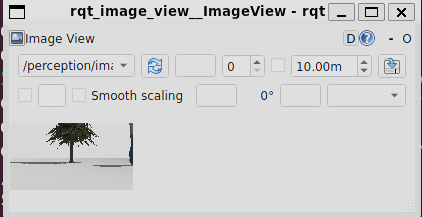
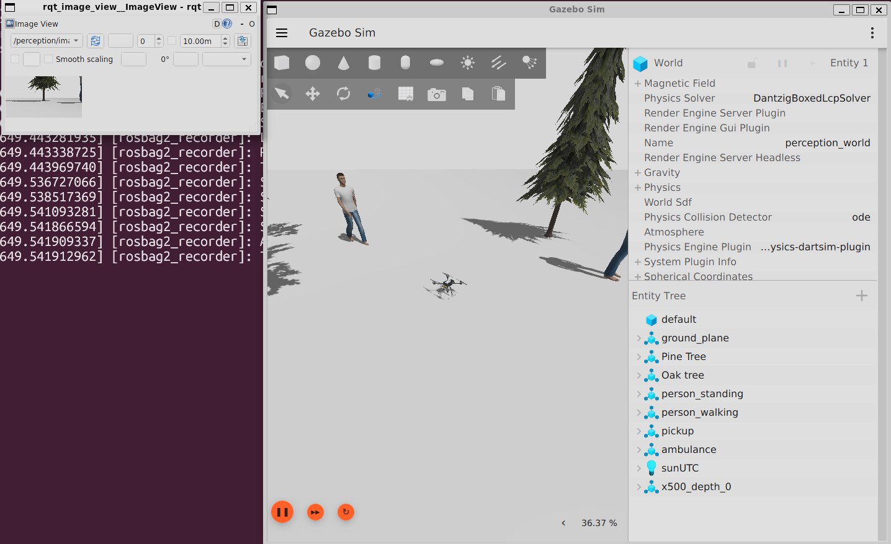
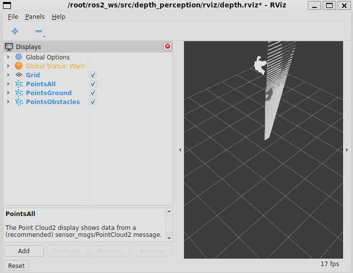
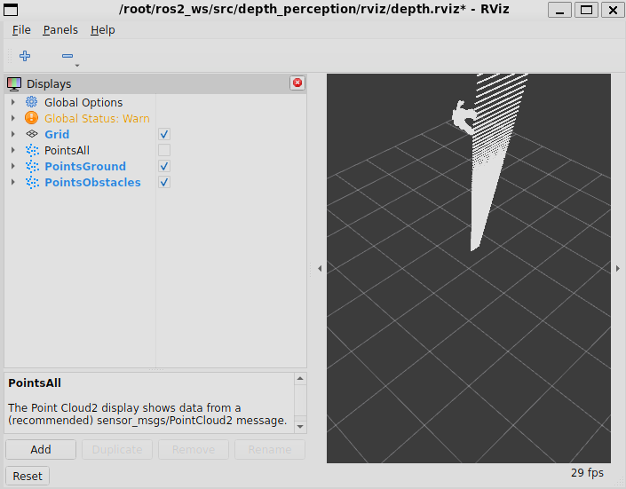
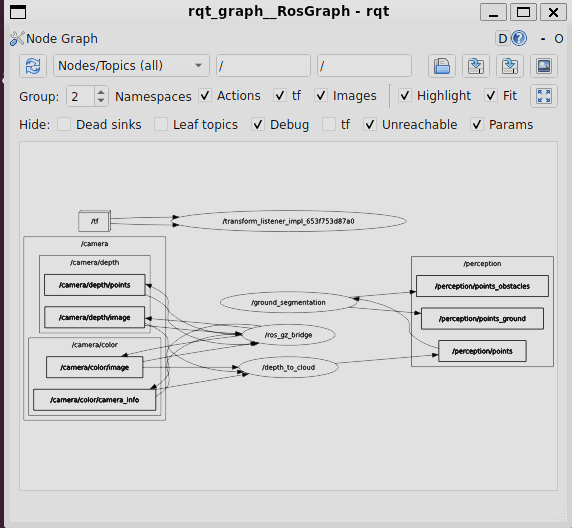
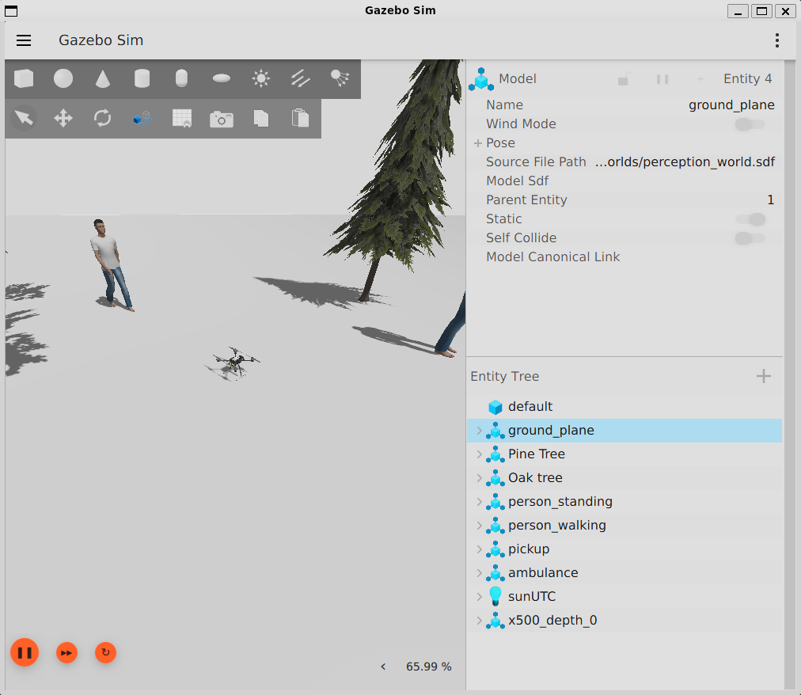

# Ubungsblatt 08 - Perception

Author: Mateo Lopez

This repository contains my solution for the perception homework using PX4 SITL, Gazebo Harmonic, ROS 2 Jazzy, a custom world, a YOLO-based RGB perception node, and a depth-based point-cloud pipeline.

## Project summary

The project runs an `x500_depth` drone inside a custom Gazebo world and exposes the onboard RGB and depth camera streams to ROS 2 through `ros_gz_bridge`.

Two perception pipelines were implemented:

1. `yolo_detector`
   Performs object detection on the RGB camera stream and publishes:
   - `/perception/image_annotated`
   - `/perception/detections`
   - `/perception/fps`
   - `/perception/latency_ms`

2. `depth_perception`
   Builds a colored point cloud from RGB + depth and separates the cloud into:
   - `/perception/points`
   - `/perception/points_ground`
   - `/perception/points_obstacles`

## Repository layout

```text
.
├── docker-compose.yml
├── px4-sitl.Dockerfile
├── worlds/perception_world.sdf
├── ros2_ws/src/perception_msgs/
├── ros2_ws/src/yolo_detector/
├── ros2_ws/src/depth_perception/
├── docs/
└── media/
    ├── setup/
    ├── aufgabe1/
    └── aufgabe2/
```

## Environment

- PX4 SITL
- Gazebo Harmonic
- ROS 2 Jazzy
- MAVROS
- `ros_gz_bridge`
- Python ROS 2 packages in `ros2_ws`

The container mounts both the custom world and the ROS workspace:

```yaml
volumes:
  - /tmp/.X11-unix:/tmp/.X11-unix:rw
  - ./worlds:/root/worlds:rw
  - ./ros2_ws:/root/ros2_ws:rw
```

The custom Gazebo world is:

- `worlds/perception_world.sdf`

It contains the default ground plane plus added Fuel models:

- Pine Tree
- Oak Tree
- Standing Person
- Walking Person
- Pickup
- Ambulance

## Reproduction

### 1. Start the container

```bash
cd exercise08_Mateo
docker compose up -d
```

### 2. Terminal T1 - PX4 + Gazebo

```bash
docker exec -it px4_sitl bash
source /opt/ros/jazzy/setup.bash
export PX4_GZ_WORLD=perception_world
cd /root/PX4-Autopilot
make px4_sitl gz_x500_depth
```

### 3. Terminal T2 - Gazebo bridge

```bash
docker exec -it px4_sitl bash
source /opt/ros/jazzy/setup.bash
ros2 run ros_gz_bridge parameter_bridge \
  /world/perception_world/model/x500_depth_0/link/camera_link/sensor/IMX214/camera_info@sensor_msgs/msg/CameraInfo@gz.msgs.CameraInfo \
  /world/perception_world/model/x500_depth_0/link/camera_link/sensor/IMX214/image@sensor_msgs/msg/Image@gz.msgs.Image \
  /depth_camera@sensor_msgs/msg/Image@gz.msgs.Image \
  /depth_camera/points@sensor_msgs/msg/PointCloud2@gz.msgs.PointCloudPacked \
  --ros-args \
  -r /world/perception_world/model/x500_depth_0/link/camera_link/sensor/IMX214/camera_info:=/camera/color/camera_info \
  -r /world/perception_world/model/x500_depth_0/link/camera_link/sensor/IMX214/image:=/camera/color/image \
  -r /depth_camera:=/camera/depth/image \
  -r /depth_camera/points:=/camera/depth/points
```

### 4. Terminal T3 - MAVROS

```bash
docker exec -it px4_sitl bash
source /opt/ros/jazzy/setup.bash
ros2 launch mavros px4.launch fcu_url:=udp://:14540@localhost:14557
```

## Aufgabe 1 - YOLO object detection

### Packages

- `ros2_ws/src/perception_msgs`
- `ros2_ws/src/yolo_detector`

Custom messages:

- `perception_msgs/msg/Detection.msg`
- `perception_msgs/msg/DetectionArray.msg`

### Build and run

The YOLO node uses a Python virtual environment because `ultralytics` and the compatible NumPy version had to be isolated from the system Python.

#### Create the virtual environment once

```bash
docker exec -it px4_sitl bash
apt-get update
apt-get install -y python3.12-venv
rm -rf /root/yolo_venv
python3 -m venv /root/yolo_venv
source /root/yolo_venv/bin/activate
pip install --upgrade pip
pip install "numpy<2" ultralytics opencv-python torch
```

#### Build and launch the node

```bash
docker exec -it px4_sitl bash
export PYTHONPATH=/root/yolo_venv/lib/python3.12/site-packages:$PYTHONPATH
source /opt/ros/jazzy/setup.bash
cd /root/ros2_ws
colcon build --packages-select perception_msgs yolo_detector
source install/setup.bash
ros2 launch yolo_detector yolo.launch.py
```

#### Visualize annotated detections

```bash
docker exec -it px4_sitl bash
export PYTHONPATH=/root/yolo_venv/lib/python3.12/site-packages:$PYTHONPATH
source /opt/ros/jazzy/setup.bash
source /root/ros2_ws/install/setup.bash
ros2 run rqt_image_view rqt_image_view /perception/image_annotated
```

### Aufgabe 1 artifacts

Available in the repository:

- `media/aufgabe1/01_detections_rqt.png`
  Screenshot of `rqt_image_view` showing the annotated detection stream.

- `media/aufgabe1/02_gazebo_plus_detections.png`
  Side-by-side screenshot of Gazebo and the annotated RGB output.

- `docs/yolo_fps.log`
  Logged FPS output from `/perception/fps`.

Local-only bag (ignored by git):

- `media/aufgabe1/bag_yolo_demo`

Note:
- I do not currently see `media/aufgabe1/03_yolo_demo.mp4` in the repository. If it exists locally but is not saved yet, it should be added as the Aufgabe 1 demo video before final submission.

#### Embedded figures

Detection output in `rqt_image_view`:



Gazebo and annotated detection side-by-side:



## Aufgabe 2 - Depth perception and segmentation

### Package

- `ros2_ws/src/depth_perception`

The implementation contains:

- `depth_perception/depth_node.py`
  Converts synchronized RGB + depth images into a colored `PointCloud2`.

- `depth_perception/ground_segmentation_node.py`
  Splits the point cloud into ground and obstacle points.

- `launch/depth.launch.py`
- `rviz/depth.rviz`

### Build and run

```bash
docker exec -it px4_sitl bash
source /opt/ros/jazzy/setup.bash
cd /root/ros2_ws
colcon build --packages-select depth_perception
source install/setup.bash
ros2 launch depth_perception depth.launch.py
```

#### RViz visualization

```bash
docker exec -it px4_sitl bash
source /opt/ros/jazzy/setup.bash
source /root/ros2_ws/install/setup.bash
rviz2 -d /root/ros2_ws/src/depth_perception/rviz/depth.rviz
```

### Aufgabe 2 artifacts

All required screenshots are present:

- `media/aufgabe2/01_points_color.png`
  Full point-cloud visualization in RViz.

- `media/aufgabe2/02_points_segmented.png`
  Segmented ground and obstacle point clouds in RViz.

- `media/aufgabe2/03_depth_demo.mp4`
  Short demo capture of the depth / point-cloud pipeline.

- `media/aufgabe2/04_rqt_graph.png`
  ROS graph evidence for the depth pipeline.

Local-only bag (ignored by git):

- `media/aufgabe2/bag_depth_demo`

#### Embedded figures

Full point cloud:



Ground / obstacle segmentation:



ROS graph evidence:



## Setup and debugging evidence

The repository also contains setup and verification artifacts:

- `docs/docker_ps.txt`
- `docs/topics_phase1.txt`
- `docs/perception_msgs.md`
- `docs/yolo_fps.log`

Setup screenshots:

- `media/setup/02_gazebo_default.png`
- `media/setup/03_topics.png`
- `media/setup/04_world_file_created.png`
- `media/setup/05_world_mounted.png`
- `media/setup/06_perception_world_overview.png`
- `media/setup/08_perception_msgs_interfaces.png`

Custom world overview:



## Important notes

- ROS bags are intentionally ignored in `.gitignore` because GitHub rejects these files due to size.
- The Gazebo / `rqt_graph` GUI was unstable under the WSL/X11 setup, but the ROS nodes and topics were verified directly from the terminal as well.
- The custom world and ROS workspace are bind-mounted into the container, so host-side file ownership mattered during development.

## What is still left before final submission

From the current repository state, the main remaining checks are:

1. Ensure `media/aufgabe1/03_yolo_demo.mp4` exists if the assignment requires a YOLO demo video.
2. Verify the README renders correctly on GitHub after push.
3. Push only source code, docs, screenshots, and small videos. Do not push bags.
4. Submit the GitHub URL on ILIAS.